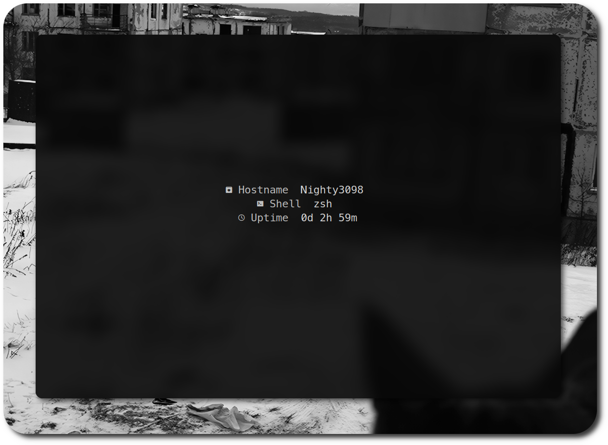
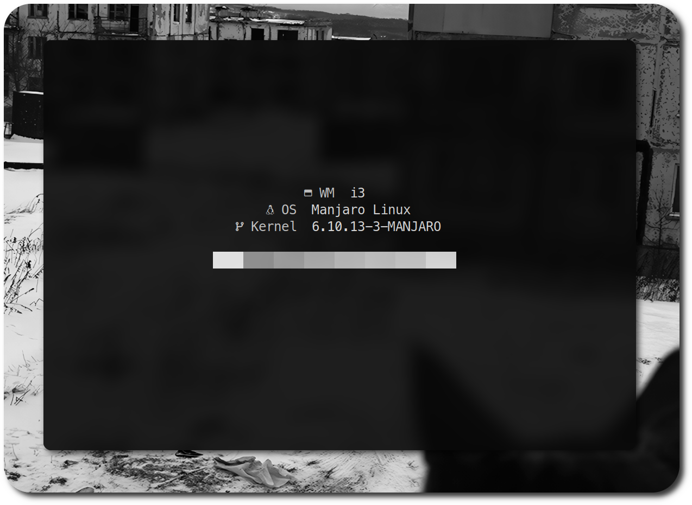
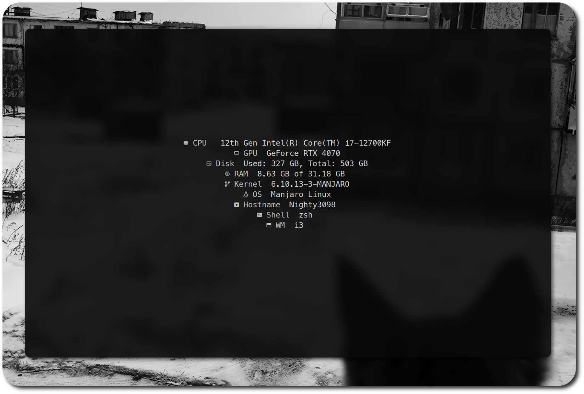

<div align="center">
    <h1>🌿 nFetch</h1>
    
    <h3>🌆 A simple fetch tool for Linux written in C</h3>
    <br>
    <a href="./LICENSE.md"></a>
    
    <br>
    <br>
    <a href="https://discord.com/channels/1238858182403559505"></a>
    <br><br>
</div>
<h3 align="center">🛠️ Installing</h3>

```bash
git clone https://github.com/Nighty3098/nFetch
cd nFetch/src
make
```

```bash
make install
```

```bash
nfetch
```

<div align="center">
    <h3>Images</h3>
    <br>
    
    <br>
    
    <br>
    
</div>
